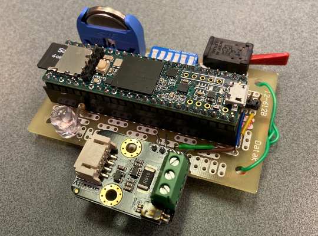

# Current/Voltage DataLogger

## Open source data logger for voltage and current using Teensy 3.5 microcontroller 
Reads current and/or voltage and records data on SD card 
Based on DFRobot INA219-based board 
Supports voltage from 0 to 26 V and current for -8 to +8 A (bidirectionnal) 
Sampling frequency of the recordings adjustable from 5 to 1000 Hz 
Sampling buffer size of either 2,000 or 20,000 measurements 
Date and time of the recording is stored using Teensy RTC 
Optional zero-phase filtering of the data 

## Bill of materials:
Teensy 3.5 https://www.pjrc.com/store/teensy35.html 
DFRobot INA219 board: https://www.dfrobot.com/product-1827.html 
protoboard (surplus) 
6-row dipswitch https://www.digikey.ca/en/products/detail/te-connectivity-alcoswitch-switches/3-5435640-7/969216 
toggle switch (surplus) 
common anode bicolor led https://www.digikey.ca/en/products/detail/lumex-opto-components-inc/SSL-LX3059IGW-CA/ 
2x24 female 0.1" header (1x4 optional for the sensor)  
2x24 + 1x2 + 1x5 male 0.1" header 
coin cell holder https://www.digikey.ca/en/products/detail/te-connectivity-amp-connectors/1775485-2/5272886 
CR2032 battery https://www.digikey.ca/en/products/detail/panasonic-bsg/CR2032/31939 
